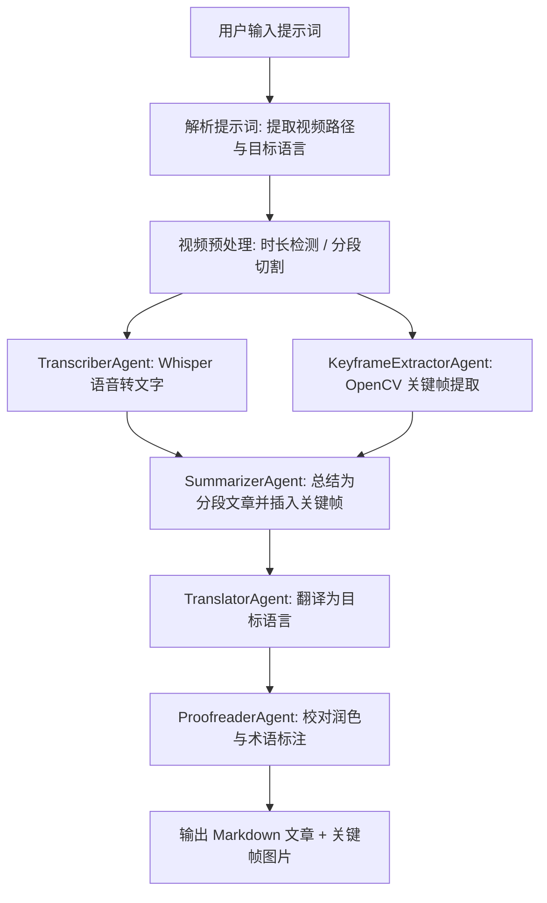

# AI VTT Agents Team

[English](./README_EN.md) | 中文

基于 [agentscope](https://github.com/modelscope/agentscope) 框架的多 Agent 视频转录翻译系统。输入一段视频，自动完成语音转录、关键帧提取、内容总结、多语言翻译和校对润色，最终输出图文并茂的 Markdown 文章。

## 演示

[](https://www.bilibili.com/video/BV13RDVBDEJz/)

## 特性

- **多 Agent 协作** — 5 个专业 Agent 各司其职，流水线自动编排
- **视频智能分段** — 长视频自动切割为 10 分钟片段，逐段处理后合并
- **断点续传** — 每完成一个片段即保存进度，失败后重启自动从上次断点继续
- **关键帧提取** — 基于场景切换检测 + 像素级去重，自动插入文章对应位置
- **多语言翻译** — 支持中文、英文、日文、韩文、法文、德文等
- **Web UI** — 可视化配置 + 自然语言交互，实时查看处理日志
- **Markdown 预览与下载** — 翻译完成后在页面直接预览并下载 `.md` 文件

## 系统架构



## 快速开始

### 环境要求

- Python 3.13+
- [uv](https://docs.astral.sh/uv/) (推荐) 或 pip
- ffmpeg（系统级安装）
- [DashScope API Key](https://dashscope.console.aliyun.com/)（通义千问）

### 安装

```bash
# 克隆项目
git clone https://github.com/your-org/ai-vtt-agents-team.git
cd ai-vtt-agents-team

# 安装 uv（如未安装）
curl -LsSf https://astral.sh/uv/install.sh | sh

# 同步安装所有依赖
uv sync

# 设置 DashScope API Key
export DASHSCOPE_API_KEY="sk-xxxxxxxxxxxxxxxxxxxxxxxx"
```

### 命令行使用

```bash
# 方式一：自然语言提示词
uv run vtt "帮我把桌面上的 demo.mp4 翻译成中文文章"

# 方式二：指定参数
uv run vtt --video /path/to/video.mp4 --language 中文

# 方式三：python -m 方式
uv run python -m src.main "帮我把 ~/Desktop/demo.mp4 转录成英文文章"
```

### Web UI 使用

```bash
# 启动 Web 服务（默认端口 8080）
uv run vtt-web

# 浏览器访问
open http://localhost:8080
```

Web UI 支持：
- 左侧面板配置 API Key、模型、Whisper 参数、关键帧参数
- 右侧对话窗输入自然语言指令，如 `帮我把桌面上的 demo.mp4 翻译成中文文章`
- 实时查看处理日志
- 翻译完成后预览 Markdown 文章并下载

## 项目结构

```
ai-vtt-agents-team/
├── README.md                   # 中文说明
├── README_EN.md                # English README
├── design_spec.md              # 详细设计文档
├── pyproject.toml              # 项目配置与依赖管理
├── config/
│   └── agent_config.json       # Agent 和模型配置
├── src/
│   ├── main.py                 # CLI 入口
│   ├── agents/                 # Agent 定义
│   │   ├── transcriber.py      #   语音转文字 Agent
│   │   ├── keyframe.py         #   关键帧提取 Agent
│   │   ├── summarizer.py       #   内容总结 Agent
│   │   ├── translator.py       #   翻译 Agent
│   │   └── proofreader.py      #   校对润色 Agent
│   ├── tools/                  # 工具封装
│   │   ├── whisper_tool.py     #   Whisper 语音识别
│   │   ├── video_tool.py       #   OpenCV 关键帧提取
│   │   └── video_splitter.py   #   ffmpeg 视频分段
│   ├── pipelines/
│   │   └── vtt_pipeline.py     #   工作流编排（含断点续传）
│   └── web/                    # Web UI
│       ├── app.py              #   FastAPI 后端
│       ├── templates/          #   Jinja2 页面模板
│       └── static/             #   CSS / JS 静态资源
└── output/                     # 输出目录
    └── articles/               #   按主题分目录
        └── {topic-slug}/
            ├── keyframes/      #     关键帧图片
            ├── part000_中文.md  #     各片段独立文章
            ├── *.md            #     最终合并文章
            └── pipeline_state.json  # 断点续传状态
```

## 配置说明

### agent_config.json

```json
{
  "model_configs": [
    {
      "config_name": "dashscope_qwen",
      "model_type": "openai_chat",
      "model_name": "qwen3.6-plus",
      "api_key": "${DASHSCOPE_API_KEY}",
      "base_url": "https://dashscope.aliyuncs.com/compatible-mode/v1"
    }
  ],
  "agent_configs": {
    "transcriber": {
      "model_config_name": "dashscope_qwen",
      "whisper_model_size": "small"
    },
    "keyframe_extractor": {
      "model_config_name": "dashscope_qwen",
      "scene_threshold": 0.08,
      "min_interval_sec": 5
    },
    "summarizer": { "model_config_name": "dashscope_qwen" },
    "translator":  { "model_config_name": "dashscope_qwen" },
    "proofreader": { "model_config_name": "dashscope_qwen" }
  }
}
```

### Whisper 模型选择

| 模型 | 参数量 | 内存需求 | 推荐场景 |
|------|--------|----------|----------|
| tiny | 39M | ~1 GB | 快速测试 |
| base | 74M | ~1 GB | 英语短视频 |
| small | 244M | ~2 GB | 日常使用（默认） |
| medium | 769M | ~5 GB | 高质量转录 |
| large | 1550M | ~10 GB | 最高精度 |

## 技术栈

| 类别 | 选型 | 说明 |
|------|------|------|
| 多 Agent 框架 | agentscope | 阿里开源，支持 Pipeline 编排与工具调用 |
| LLM | 通义千问 (DashScope) | qwen3.6-plus，OpenAI 兼容模式 |
| 语音识别 | OpenAI Whisper | 本地运行，支持多语言 |
| 视频处理 | ffmpeg + OpenCV | 音频提取 + 关键帧检测 |
| Web 框架 | FastAPI + Jinja2 | REST API + WebSocket 实时日志 |
| 包管理 | uv + hatchling | 高性能依赖管理 |

## License

MIT
