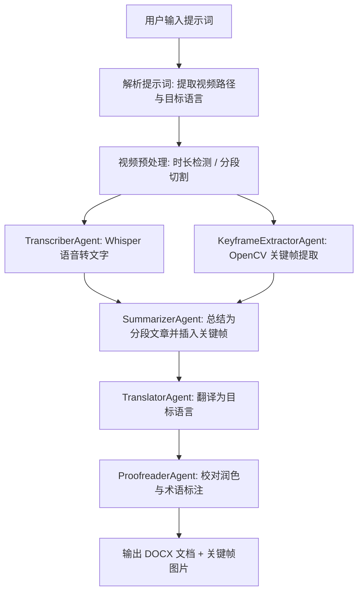

# AI VTT Agents Team

[English](./README_EN.md) | 中文

基于 [agentscope](https://github.com/modelscope/agentscope) 框架的多 Agent 视频转录翻译系统。输入一段视频，自动完成语音转录、关键帧提取、内容总结、多语言翻译和校对润色，最终输出图文并茂的 DOCX 文档。

## 演示

[](https://www.bilibili.com/video/BV13RDVBDEJz/)

## 特性

- **多 Agent 协作** — 5 个专业 Agent 各司其职，流水线自动编排
- **视频智能分段** — 长视频自动切割为 10 分钟片段，逐段处理后合并
- **断点续传** — SQLite 状态持久化，每完成一个片段即保存进度，失败后重启自动从上次断点继续
- **批量处理** — 支持目录扫描，多视频并发处理，断点续传可视化
- **关键帧提取** — 基于场景切换检测 + 像素级去重，自动插入文章对应位置
- **多语言翻译** — 支持中文、英文、日文、韩文、法文、德文等
- **DOCX 导出** — 最终输出为格式化 Word 文档，含标题、段落样式和嵌入图片
- **Web UI** — 可视化配置 + 自然语言交互 + 实时日志 + 进度条 + 批次状态管理

## 系统架构



## 安装

### 方式一：pip 安装（推荐）

```bash
# 从 PyPI 安装（发布后）
pip install ai-vtt-agents-team

# 或从 wheel 文件安装
pip install ai_vtt_agents_team-0.1.0-py3-none-any.whl

# 设置 DashScope API Key
export DASHSCOPE_API_KEY="sk-xxxxxxxxxxxxxxxxxxxxxxxx"
```

安装后即可使用两个命令行工具：
- `vtt` — 命令行视频转录翻译
- `vtt-web` — 启动 Web UI

### 方式二：从源码安装（开发模式）

```bash
# 克隆项目
git clone https://github.com/your-org/ai-vtt-agents-team.git
cd ai-vtt-agents-team

# 安装 uv（如未安装）
curl -LsSf https://astral.sh/uv/install.sh | sh

# 同步安装所有依赖
uv sync

# 设置 DashScope API Key
export DASHSCOPE_API_KEY="sk-xxxxxxxxxxxxxxxxxxxxxxxx"
```

### 方式三：从源码构建并安装

```bash
cd ai-vtt-agents-team

# 构建 wheel 包
uv build

# 安装构建产物
pip install dist/ai_vtt_agents_team-0.1.0-py3-none-any.whl
```

### 环境要求

- Python 3.10+
- ffmpeg（系统级安装）
- [DashScope API Key](https://dashscope.console.aliyun.com/)（通义千问）

## 使用教程

### 命令行使用

安装后可直接使用 `vtt` 命令：

```bash
# 单视频 — 自然语言提示词
vtt "帮我把桌面上的 demo.mp4 翻译成中文文章"

# 单视频 — 指定参数
vtt --video /path/to/video.mp4 --language 中文

# 批量处理整个目录
vtt --video /path/to/videos/ --language 中文 --concurrency 3

# 多个视频（空格分隔）
vtt --video video1.mp4 video2.mp4 video3.mp4 --language 英文

# 使用通配符
vtt --video /path/to/videos/*.mp4 --language 中文
```

**参数说明：**

| 参数 | 说明 | 默认值 |
|------|------|--------|
| `prompt` | 自然语言提示词（位置参数） | — |
| `--video` | 视频文件路径，支持多个、目录、glob 通配符 | — |
| `--language` | 目标翻译语言（中文/英文/日文/韩文/法文/德文） | 中文 |
| `--concurrency` | 多视频并发处理数 | 3 |

### Web UI 使用

```bash
# 启动 Web 服务（默认端口 8080）
vtt-web

# 浏览器访问
open http://localhost:8080
```

如果是源码开发模式：
```bash
uv run vtt-web
```

Web UI 功能：
- **左侧面板** — 配置 API Key、模型、Whisper 参数、关键帧参数
- **对话窗口** — 输入自然语言指令，如 `帮我把桌面上的 demo.mp4 翻译成中文文章`
- **实时日志** — 处理过程中实时查看日志和进度条（片段 X/Y）
- **单视频模式** — 处理单个视频，完成后预览文章并下载 .docx
- **批量模式** — 扫描目录批量处理，多视频并发，查看批次历史
- **断点续传** — 中断后可在 Web 页面查看批次状态，点击「续传」从断点继续

## 项目结构

```
ai-vtt-agents-team/
├── README.md                   # 中文说明
├── README_EN.md                # English README
├── design_spec.md              # 详细设计文档
├── pyproject.toml              # 项目配置与依赖管理
├── config/
│   └── agent_config.json       # Agent 和模型配置
├── src/
│   ├── main.py                 # CLI 入口
│   ├── agents/                 # Agent 定义
│   │   ├── transcriber.py      #   语音转文字 Agent
│   │   ├── keyframe.py         #   关键帧提取 Agent
│   │   ├── summarizer.py       #   内容总结 Agent
│   │   ├── translator.py       #   翻译 Agent
│   │   └── proofreader.py      #   校对润色 Agent
│   ├── tools/                  # 工具封装
│   │   ├── whisper_tool.py     #   Whisper 语音识别
│   │   ├── video_tool.py       #   OpenCV 关键帧提取
│   │   ├── video_splitter.py   #   ffmpeg 视频分段
│   │   └── md_to_docx.py       #   Markdown → DOCX 转换
│   ├── config/                 # 包内默认配置
│   │   └── agent_config.json   #   Agent 和模型配置
│   ├── pipelines/
│   │   ├── vtt_pipeline.py     #   工作流编排（含断点续传）
│   │   └── state_db.py         #   SQLite 状态持久化
│   └── web/                    # Web UI
│       ├── app.py              #   FastAPI 后端
│       ├── templates/          #   Jinja2 页面模板
│       └── static/             #   CSS / JS 静态资源
└── output/                     # 输出目录（视频源目录下生成）
    └── {video-slug}/
        ├── keyframes/          #   关键帧图片
        ├── *.md                #   中间 Markdown 文件
        └── *.docx              #   最终 DOCX 文档
```

## 配置说明

### 配置文件

安装后系统内置默认配置，如需自定义，可在**当前工作目录**下创建 `config/agent_config.json`，系统会优先加载。

```json
{
  "model_configs": [
    {
      "config_name": "dashscope_qwen",
      "model_type": "openai_chat",
      "model_name": "qwen3.6-plus",
      "api_key": "${DASHSCOPE_API_KEY}",
      "base_url": "https://dashscope.aliyuncs.com/compatible-mode/v1"
    }
  ],
  "agent_configs": {
    "transcriber": {
      "model_config_name": "dashscope_qwen",
      "whisper_model_size": "small"
    },
    "keyframe_extractor": {
      "model_config_name": "dashscope_qwen",
      "scene_threshold": 0.08,
      "min_interval_sec": 5
    },
    "summarizer": { "model_config_name": "dashscope_qwen" },
    "translator":  { "model_config_name": "dashscope_qwen" },
    "proofreader": { "model_config_name": "dashscope_qwen" }
  }
}
```

### Whisper 模型选择

| 模型 | 参数量 | 内存需求 | 推荐场景 |
|------|--------|----------|----------|
| tiny | 39M | ~1 GB | 快速测试 |
| base | 74M | ~1 GB | 英语短视频 |
| small | 244M | ~2 GB | 日常使用（默认） |
| medium | 769M | ~5 GB | 高质量转录 |
| large | 1550M | ~10 GB | 最高精度 |

## 技术栈

| 类别 | 选型 | 说明 |
|------|------|------|
| 多 Agent 框架 | agentscope | 阿里开源，支持 Pipeline 编排与工具调用 |
| LLM | 通义千问 (DashScope) | qwen3.6-plus，OpenAI 兼容模式 |
| 语音识别 | OpenAI Whisper | 本地运行，支持多语言 |
| 视频处理 | ffmpeg + OpenCV | 音频提取 + 关键帧检测 |
| Web 框架 | FastAPI + Jinja2 | REST API + WebSocket 实时日志 |
| 包管理 | uv + hatchling | 高性能依赖管理与打包 |

## 常见问题 (Q&A)

### Q: `pip install` 报权限错误，无法写入系统目录？

如果使用的是 miniconda / anaconda 或系统级 Python，可能会遇到类似错误：

```
ERROR: Could not install packages due to an OSError:
Cannot move the non-empty directory '/Users/xxx/miniconda3/lib/python3.13/site-packages/...':
Lacking write permission to '...'
```

**解决方法（任选其一）：**

**方法一：加 `--user` 安装到用户目录（最简单）**

```bash
pip install --user ai_vtt_agents_team-0.1.0-py3-none-any.whl
```

安装后命令行工具位于 `~/.local/bin/`，确保该目录在 PATH 中：

```bash
export PATH="$HOME/.local/bin:$PATH"
```

可将上面这行添加到 `~/.bashrc` 或 `~/.zshrc` 中永久生效。

**方法二：使用虚拟环境（推荐，隔离依赖）**

```bash
python -m venv venv
source venv/bin/activate
pip install ai_vtt_agents_team-0.1.0-py3-none-any.whl
```

虚拟环境内的 `vtt` 和 `vtt-web` 命令可直接使用，无需额外配置。

**方法三：使用 uv 管理（项目内置支持）**

```bash
# 项目目录内执行
uv sync
# 然后通过 uv run 调用
uv run vtt "..."
uv run vtt-web
```

---

## License

MIT
