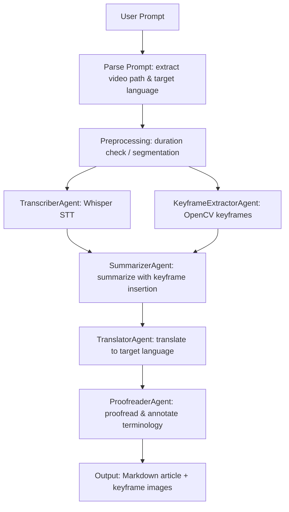

# AI VTT Agents Team

[中文](./README.md) | English

A multi-Agent video transcription and translation system built on the [agentscope](https://github.com/modelscope/agentscope) framework. Feed it a video and it automatically transcribes speech, extracts keyframes, summarizes content, translates into multiple languages, and proofreads — producing a richly illustrated Markdown article.

## Demo

[](https://www.bilibili.com/video/BV13RDVBDEJz/)

## Features

- **Multi-Agent Collaboration** — 5 specialized Agents working in an automated pipeline
- **Smart Video Segmentation** — Long videos are auto-split into 10-minute segments, processed individually, then merged
- **Checkpoint & Resume** — Progress is saved after each segment; restart picks up from the last failure
- **Keyframe Extraction** — Scene-change detection + pixel-level deduplication, auto-inserted at matching positions
- **Multi-language Translation** — Chinese, English, Japanese, Korean, French, German and more
- **Web UI** — Visual configuration + natural language interaction with real-time processing logs
- **Markdown Preview & Download** — Preview and download `.md` files directly in the browser

## Architecture



## Quick Start

### Prerequisites

- Python 3.13+
- [uv](https://docs.astral.sh/uv/) (recommended) or pip
- ffmpeg (system-level install)
- [DashScope API Key](https://dashscope.console.aliyun.com/) (Qwen / Tongyi Qianwen)

### Installation

```bash
# Clone the repo
git clone https://github.com/your-org/ai-vtt-agents-team.git
cd ai-vtt-agents-team

# Install uv (if not installed)
curl -LsSf https://astral.sh/uv/install.sh | sh

# Install all dependencies
uv sync

# Set DashScope API Key
export DASHSCOPE_API_KEY="sk-xxxxxxxxxxxxxxxxxxxxxxxx"
```

### CLI Usage

```bash
# Option 1: Natural language prompt
uv run vtt "Translate ~/Desktop/demo.mp4 into a Chinese article"

# Option 2: Explicit arguments
uv run vtt --video /path/to/video.mp4 --language 中文

# Option 3: python -m
uv run python -m src.main --video /path/to/video.mp4 --language English
```

### Web UI

```bash
# Start the web server (default port 8080)
uv run vtt-web

# Open in browser
open http://localhost:8080
```

The Web UI provides:
- **Left panel** — Configure API Key, model, Whisper settings, keyframe parameters
- **Right panel** — Chat window accepting natural language instructions (e.g. `Translate the demo.mp4 on my desktop into a Chinese article`)
- **Real-time logs** — Watch the pipeline progress as it runs
- **Result preview** — Rendered Markdown with keyframe images + download button

## Project Structure

```
ai-vtt-agents-team/
├── README.md                   # Chinese README
├── README_EN.md                # English README
├── design_spec.md              # Detailed design spec
├── pyproject.toml              # Project config & dependencies
├── config/
│   └── agent_config.json       # Agent & model configuration
├── src/
│   ├── main.py                 # CLI entry point
│   ├── agents/                 # Agent definitions
│   │   ├── transcriber.py      #   Speech-to-text Agent
│   │   ├── keyframe.py         #   Keyframe extraction Agent
│   │   ├── summarizer.py       #   Content summarization Agent
│   │   ├── translator.py       #   Translation Agent
│   │   └── proofreader.py      #   Proofreading Agent
│   ├── tools/                  # Tool wrappers
│   │   ├── whisper_tool.py     #   Whisper speech recognition
│   │   ├── video_tool.py       #   OpenCV keyframe extraction
│   │   └── video_splitter.py   #   ffmpeg video segmentation
│   ├── pipelines/
│   │   └── vtt_pipeline.py     #   Pipeline orchestration (with checkpoint)
│   └── web/                    # Web UI
│       ├── app.py              #   FastAPI backend
│       ├── templates/          #   Jinja2 templates
│       └── static/             #   CSS / JS assets
└── output/                     # Output directory
    └── articles/               #   Organized by topic
        └── {topic-slug}/
            ├── keyframes/      #     Keyframe images
            ├── part000_*.md    #     Per-segment articles
            ├── *.md            #     Final merged article
            └── pipeline_state.json  # Checkpoint state
```

## Configuration

### agent_config.json

```json
{
  "model_configs": [
    {
      "config_name": "dashscope_qwen",
      "model_type": "openai_chat",
      "model_name": "qwen3.6-plus",
      "api_key": "${DASHSCOPE_API_KEY}",
      "base_url": "https://dashscope.aliyuncs.com/compatible-mode/v1"
    }
  ],
  "agent_configs": {
    "transcriber": {
      "model_config_name": "dashscope_qwen",
      "whisper_model_size": "small"
    },
    "keyframe_extractor": {
      "model_config_name": "dashscope_qwen",
      "scene_threshold": 0.08,
      "min_interval_sec": 5
    },
    "summarizer": { "model_config_name": "dashscope_qwen" },
    "translator":  { "model_config_name": "dashscope_qwen" },
    "proofreader": { "model_config_name": "dashscope_qwen" }
  }
}
```

### Whisper Model Selection

| Model | Parameters | Memory | Recommended For |
|-------|-----------|--------|-----------------|
| tiny | 39M | ~1 GB | Quick testing |
| base | 74M | ~1 GB | English short videos |
| small | 244M | ~2 GB | General use (default) |
| medium | 769M | ~5 GB | High-quality transcription |
| large | 1550M | ~10 GB | Maximum accuracy |

## Tech Stack

| Category | Choice | Notes |
|----------|--------|-------|
| Multi-Agent Framework | agentscope | Alibaba open-source, Pipeline orchestration & tool calling |
| LLM | Qwen (DashScope) | qwen3.6-plus via OpenAI-compatible endpoint |
| Speech Recognition | OpenAI Whisper | Runs locally, multi-language support |
| Video Processing | ffmpeg + OpenCV | Audio extraction + keyframe detection |
| Web Framework | FastAPI + Jinja2 | REST API + WebSocket real-time logs |
| Package Manager | uv + hatchling | High-performance dependency management |

## License

MIT
