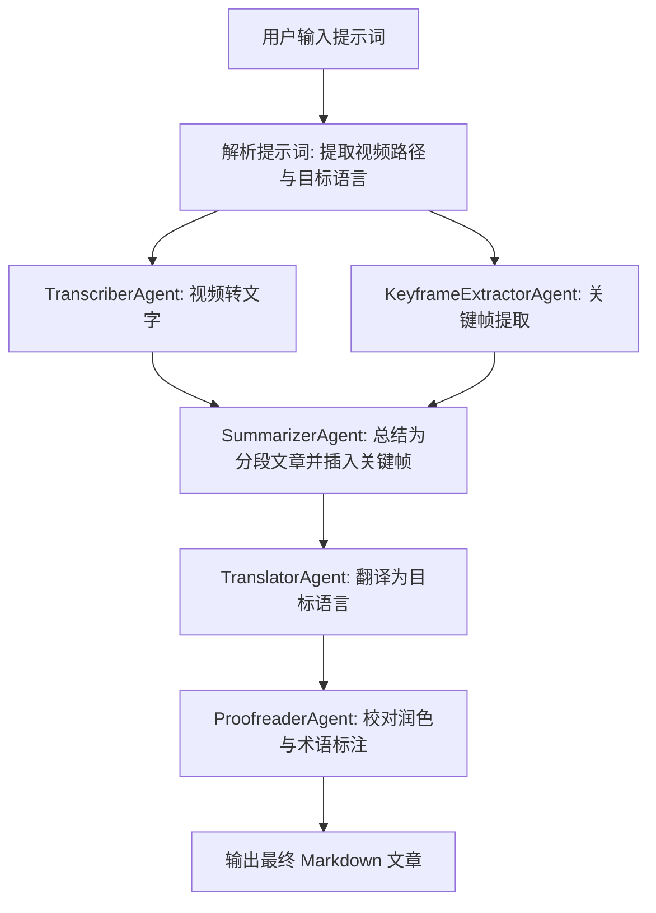
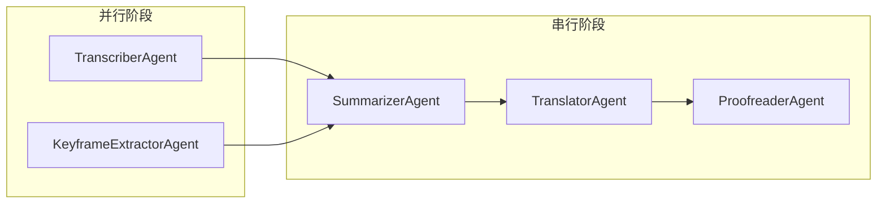

## 1. 系统架构概览

### 1.1 整体流程



### 1.2 Agent 间消息传递关系

| 发送方 | 接收方 | 传递内容 |
|--------|--------|----------|
| 用户 | Pipeline 入口 | 提示词（含视频路径、目标语言） |
| TranscriberAgent | SummarizerAgent | 带时间戳的字幕数据 (JSON) |
| KeyframeExtractorAgent | SummarizerAgent | 关键帧图片路径与时间戳列表 (JSON) |
| SummarizerAgent | TranslatorAgent | 分段 Markdown 文章（含关键帧引用） |
| TranslatorAgent | ProofreaderAgent | 翻译后的 Markdown 文章 |
| ProofreaderAgent | 用户 | 最终校对润色后的 Markdown 文章 |

### 1.3 agentscope 核心概念

- **Agent**: 具有独立角色和能力的智能体，包含系统提示词、模型配置和可调用的工具
- **Pipeline**: 编排多个 Agent 执行顺序的工作流容器，支持顺序执行 (SequentialPipeline) 和并行执行 (ParallelPipeline)
- **Message**: Agent 之间传递信息的标准数据结构，包含 `name`（发送者）、`role`（角色）、`content`（内容）等字段

---

## 2. 技术选型

| 类别 | 选型 | 说明 |
|------|------|------|
| 包管理工具 | uv | 高性能 Python 包管理器，替代 pip/venv，通过 pyproject.toml 管理依赖 |
| 多 Agent 框架 | agentscope | 阿里开源多 Agent 框架，支持 Pipeline 编排与工具调用 |
| LLM 服务 | DashScope (通义千问 API) | 用于总结、翻译、校对等需要语言理解的 Agent |
| 语音转文字 | OpenAI Whisper (本地模型) | 支持多语言语音识别，可离线运行 |
| 视频处理 | ffmpeg + OpenCV | ffmpeg 用于音频提取，OpenCV 用于关键帧检测与截取 |
| Python 版本 | 3.13+ | 使用最新稳定版 Python |

---

## 3. 各 Agent 详细定义

### 3.1 TranscriberAgent（视频转文字）

- **角色名称**: `transcriber`
- **系统提示词**:
  ```
  你是一个视频转录专家。你的任务是接收视频文件路径，调用 Whisper 工具将视频中的语音转录为带时间戳的字幕文本。输出必须为结构化的 JSON 格式。
  ```
- **输入**: 视频文件路径 (string)
- **输出**: 带时间戳的字幕数据 (JSON)
  ```json
  {
    "segments": [
      {
        "id": 0,
        "start": 0.0,
        "end": 3.5,
        "text": "Hello and welcome to this tutorial."
      }
    ],
    "language": "en"
  }
  ```
- **工具**: `whisper_tool` — 封装 Whisper 模型的加载与推理
- **异常处理**:
  - 视频文件不存在 -> 返回错误消息并终止 Pipeline
  - 音频提取失败 -> 尝试使用 ffmpeg 重新提取后重试一次
  - Whisper 推理超时 -> 降级使用更小的模型 (base)

### 3.2 KeyframeExtractorAgent（关键帧提取）

- **角色名称**: `keyframe_extractor`
- **系统提示词**:
  ```
  你是一个视频关键帧提取专家。你的任务是接收视频文件路径，调用视频处理工具提取关键帧图片，并记录每个关键帧对应的时间戳。
  ```
- **输入**: 视频文件路径 (string)
- **输出**: 关键帧信息列表 (JSON)
  ```json
  {
    "keyframes": [
      {
        "timestamp": 5.2,
        "image_path": "output/keyframes/frame_005200.jpg"
      }
    ]
  }
  ```
- **工具**: `video_tool` — 封装 ffmpeg 音频提取与 OpenCV 关键帧检测
- **关键帧提取策略**: 基于帧间差异 (场景切换检测)，阈值可配置
- **异常处理**:
  - 视频文件不存在 -> 返回错误消息并终止 Pipeline
  - 视频无法解码 -> 尝试使用 ffmpeg 转码后重试
  - 关键帧数量为 0 -> 按固定时间间隔 (每 30 秒) 截取

### 3.3 SummarizerAgent（总结字幕）

- **角色名称**: `summarizer`
- **系统提示词**:
  ```
  你是一个专业的内容总结编辑。你的任务是将视频字幕内容整理成一篇结构清晰的文章。要求：
  1. 将内容按主题分成多个段落
  2. 每个段落前给出简明的总结标题
  3. 在合适的位置插入视频关键帧图片（使用 Markdown 图片语法）
  4. 关键帧应插入在与其时间戳最接近的段落中
  5. 保持原文语言，不进行翻译
  ```
- **输入**: TranscriberAgent 的字幕 JSON + KeyframeExtractorAgent 的关键帧 JSON
- **输出**: Markdown 格式的分段文章
  ```markdown
  ## 段落标题

  段落内容...

  

  更多内容...
  ```
- **工具**: 无额外工具，直接调用 DashScope LLM
- **异常处理**:
  - LLM 返回格式不符 -> 追加格式要求重新请求 (最多重试 2 次)
  - 字幕为空 -> 返回提示信息，跳过后续 Agent

### 3.4 TranslatorAgent（翻译字幕）

- **角色名称**: `translator`
- **系统提示词**:
  ```
  你是一个专业翻译。你的任务是将给定的 Markdown 文章翻译为目标语言。要求：
  1. 保持 Markdown 格式不变
  2. 保留图片引用和链接
  3. 翻译要准确自然，符合目标语言的表达习惯
  4. 专业术语优先使用目标语言的通用译法
  ```
- **输入**: Markdown 文章 + 目标语言
- **输出**: 翻译后的 Markdown 文章
- **工具**: 无额外工具，直接调用 DashScope LLM
- **异常处理**:
  - LLM 返回不完整 -> 分段重新翻译并合并
  - 目标语言不支持 -> 返回错误消息

### 3.5 ProofreaderAgent（校对文章）

- **角色名称**: `proofreader`
- **系统提示词**:
  ```
  你是一个严谨的文章校对专家。你的任务是对翻译后的文章进行逐行校对。要求：
  1. 检查翻译的准确性和流畅度
  2. 标注专业术语（使用括号附上原文，如：机器学习(Machine Learning)）
  3. 对不通顺的句子进行润色
  4. 保持 Markdown 格式不变
  5. 输出校对后的最终版本
  ```
- **输入**: 翻译后的 Markdown 文章
- **输出**: 校对润色后的最终 Markdown 文章
- **工具**: 无额外工具，直接调用 DashScope LLM
- **异常处理**:
  - LLM 返回格式不符 -> 追加格式要求重新请求

---

## 4. 工作流定义 (Pipeline)

### 4.1 执行策略



- **阶段一 (并行)**: TranscriberAgent 和 KeyframeExtractorAgent 同时处理视频，分别提取字幕和关键帧
- **阶段二 (串行)**: SummarizerAgent 接收两者的输出，生成分段文章
- **阶段三 (串行)**: TranslatorAgent 翻译文章
- **阶段四 (串行)**: ProofreaderAgent 校对最终文章

### 4.2 Pipeline 编排方式

使用 agentscope 的 `ForLoopPipeline` 或自定义 Pipeline 实现：

```python
import agentscope
from agentscope.pipelines import SequentialPipeline

# 阶段一: 并行执行转录和关键帧提取
results = await asyncio.gather(
    transcriber_agent(video_msg),
    keyframe_agent(video_msg),
)

# 阶段二~四: 顺序执行
pipeline = SequentialPipeline(
    agents=[summarizer_agent, translator_agent, proofreader_agent]
)
final_output = pipeline(merged_msg)
```

---

## 5. 消息格式规范

### 5.1 通用 Message 结构

基于 agentscope 的 `Msg` 类：

```python
from agentscope.message import Msg

msg = Msg(
    name="agent_name",   # 发送者名称
    role="assistant",     # 角色: user / assistant / system
    content="...",        # 主要内容 (str 或 dict)
)
```

### 5.2 各阶段数据格式

| 阶段 | 格式 | 说明 |
|------|------|------|
| 字幕数据 | JSON | 包含 segments 数组，每个 segment 有 id、start、end、text 字段 |
| 关键帧数据 | JSON | 包含 keyframes 数组，每个 keyframe 有 timestamp、image_path 字段 |
| 总结文章 | Markdown | 分段文章，含标题和关键帧图片引用 |
| 翻译文章 | Markdown | 翻译后的分段文章 |
| 最终文章 | Markdown | 校对润色后的最终版本 |

---

## 6. 项目目录结构

```
ai-vtt-agents-team/
├── design_spec.md              # 设计文档
├── pyproject.toml              # 项目配置与依赖管理 (uv)
├── config/
│   └── agent_config.json       # Agent 和模型配置
├── src/
│   ├── main.py                 # 入口，解析用户输入并启动 Pipeline
│   ├── agents/
│   │   ├── __init__.py
│   │   ├── transcriber.py      # 视频转文字 Agent
│   │   ├── keyframe.py         # 关键帧提取 Agent
│   │   ├── summarizer.py       # 总结 Agent
│   │   ├── translator.py       # 翻译 Agent
│   │   └── proofreader.py      # 校对 Agent
│   ├── tools/
│   │   ├── __init__.py
│   │   ├── whisper_tool.py     # Whisper 模型封装
│   │   └── video_tool.py       # 视频处理工具 (ffmpeg + OpenCV)
│   └── pipelines/
│       ├── __init__.py
│       └── vtt_pipeline.py     # 工作流编排
└── output/                     # 输出目录
    ├── keyframes/              # 关键帧图片
    └── articles/               # 生成的文章
```

---

## 7. 配置说明

### 7.1 环境初始化

使用 uv 初始化项目环境并安装依赖：

```bash
# 安装 uv（如未安装）
curl -LsSf https://astral.sh/uv/install.sh | sh

# 同步安装所有依赖
uv sync

# 设置 DashScope API Key
export DASHSCOPE_API_KEY="sk-xxxxxxxxxxxxxxxxxxxxxxxx"
```

### 7.2 DashScope API 配置

通过环境变量配置：

```bash
export DASHSCOPE_API_KEY="sk-xxxxxxxxxxxxxxxxxxxxxxxx"
```

`config/agent_config.json` 示例：

```json
{
  "model_configs": [
    {
      "config_name": "dashscope_qwen",
      "model_type": "dashscope_chat",
      "model_name": "qwen-max",
      "api_key": "${DASHSCOPE_API_KEY}"
    }
  ],
  "agent_configs": {
    "transcriber": {
      "model_config_name": "dashscope_qwen",
      "whisper_model_size": "medium"
    },
    "keyframe_extractor": {
      "model_config_name": "dashscope_qwen",
      "scene_threshold": 30.0,
      "min_interval_sec": 5
    },
    "summarizer": {
      "model_config_name": "dashscope_qwen"
    },
    "translator": {
      "model_config_name": "dashscope_qwen"
    },
    "proofreader": {
      "model_config_name": "dashscope_qwen"
    }
  }
}
```

### 7.3 Whisper 模型选择

| 模型 | 参数量 | VRAM 需求 | 推荐场景 |
|------|--------|-----------|----------|
| tiny | 39M | ~1 GB | 快速测试 |
| base | 74M | ~1 GB | 英语为主的短视频 |
| small | 244M | ~2 GB | 多语言日常使用 |
| medium | 769M | ~5 GB | 高质量转录 (推荐) |
| large | 1550M | ~10 GB | 最高精度 |

### 7.4 输出格式配置

- 默认输出路径: `output/articles/`
- 文章格式: Markdown (`.md`)
- 关键帧格式: JPEG (`.jpg`)
- 文件命名: `{视频名}_{目标语言}_{时间戳}.md`

### 7.5 运行方式

```bash
# 自然语言提示词方式
uv run python -m src.main "帮我把桌面上的 demo.mp4 转录成中文文章"

# 命令行参数方式
uv run python -m src.main --video /path/to/video.mp4 --language 中文

# 也可通过项目脚本入口
uv run vtt "帮我把桌面上的 demo.mp4 转录成中文文章"
```
